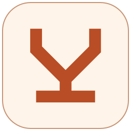
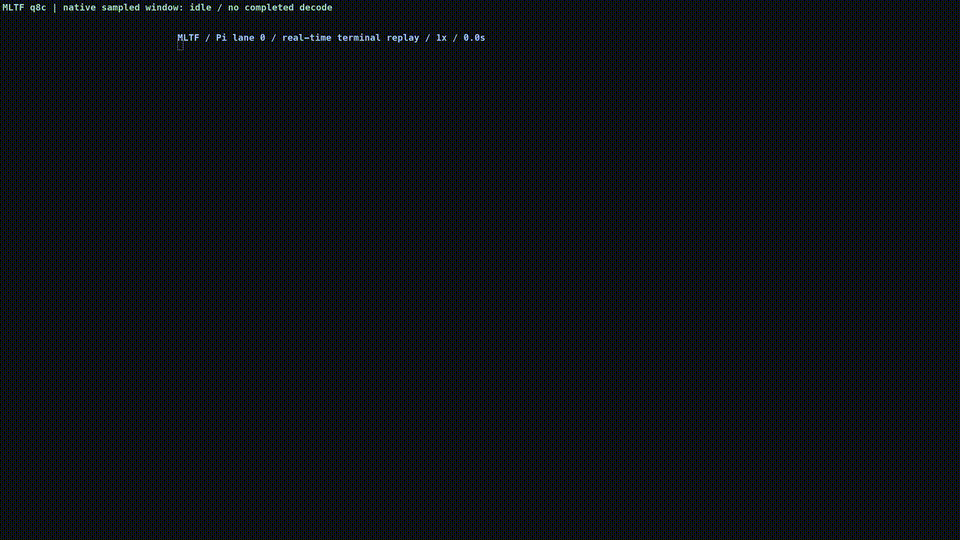
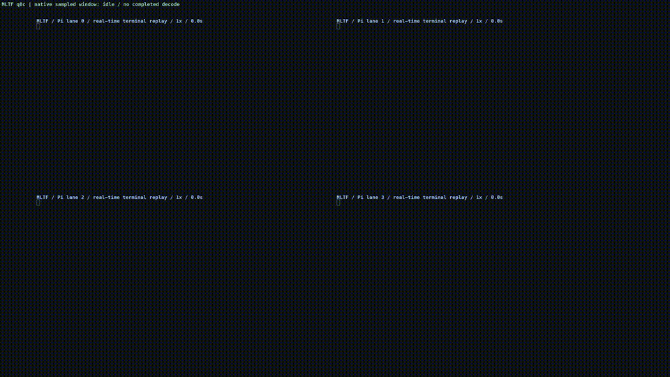
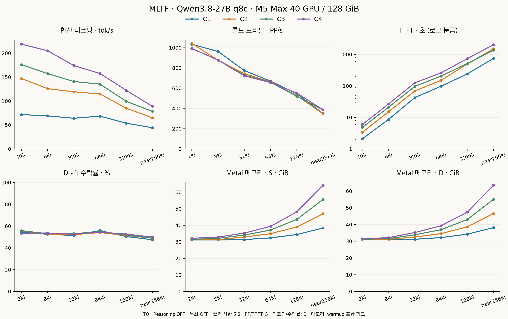

# MLTF · My Little Trie Forge

<p align="center"></p>

[English](README.md) · [전체 벤치마크](docs/BENCHMARKS.ko.md) · [Pi 데모](docs/DEMO.ko.md) · [설치](docs/INSTALL.ko.md)

**8비트 Qwen3.8-27B. 빠른 로컬 코딩. 256Ki 컨텍스트.**

MLTF는 M5 Max MacBook Pro에서 Qwen3.8-27B를 빠르고 메모리 효율적으로 실행하기 위한 프로젝트입니다. 한 모델과 기기에 맞춰 Metal 커널과 캐시를 구성합니다.

## 실측 성능

**MacBook Pro · M5 Max · GPU 40코어 · 통합 메모리 128GiB**

| 단일 요청 콜드 프리필 (2Ki) | 단일 요청 TTFT | 단일 요청 디코딩 | 네 요청 합산 디코딩 |
|---:|---:|---:|---:|
| **1,033.8 PP/s** | **2.094 s** | **71.7 tok/s** | **218.9 tok/s** |

## 데모 영상

**C1 데모**

[](docs/media/pi-c1-xhigh-t1-4k30.mp4)

**C4 데모**

[](docs/media/pi-c4-xhigh-t1-4k30.mp4)

Reasoning을 화면에 표시한 실제 코딩 영상입니다. xhigh·온도 1·출력 상한 128Ki를 사용했으며, 전체 영상은 **4K·30fps·1×**로 재생합니다.

[C1 전체 영상](docs/media/pi-c1-xhigh-t1-4k30.mp4) · [C4 전체 영상](docs/media/pi-c4-xhigh-t1-4k30.mp4) · [테스트 결과와 녹화 부하](docs/DEMO.ko.md)

## 주요 기능

- Qwen3.8 전용 Metal 커널, 8비트 프리필, DFlash2 검증, INT8 KV 캐시를 사용합니다.
- Prefix-tree 캐시로 문맥을 재사용하고, 필요하면 SSD 캐시를 켤 수 있습니다.
- 가용 메모리에 맞춰 동시 요청 수를 조절합니다.

## 컨텍스트별 성능



`C`는 동시 요청 수입니다. PP/s는 초당 입력 토큰 수, TTFT는 첫 content 토큰까지의 시간입니다. PP·TTFT는 자연 서빙(S), 디코딩·수락률은 all-ready(D) 실측이며, 메모리는 각각의 Metal 피크입니다.

**T0·Reasoning OFF·녹화 OFF·출력 상한 512.** 콜드 요청은 KV 캐시를 재사용하지 않습니다. 처리량·TTFT는 중앙값, 메모리는 최댓값입니다.

| 입력/요청 | C | 콜드 PP/s | TTFT (초) | 디코딩 tok/s | 수락률 | 메모리 S/D (GiB) |
|---|---:|---:|---:|---:|---:|---:|
| 2Ki | 1 | 1,033.8 | 2.094 | 71.7 | 54.4% | 31.135 / 31.134 |
|  | 2 | 1,042.0 | 3.352 | 147.1 | 55.6% | 31.135 / 31.134 |
|  | 3 | 992.7 | 4.823 | 176.1 | 55.8% | 31.483 / 31.134 |
|  | 4 | 992.4 | 5.925 | 218.9 | 53.3% | 32.119 / 31.388 |
| 8Ki | 1 | 963.0 | 8.638 | 68.9 | 52.4% | 31.135 / 31.134 |
|  | 2 | 876.0 | 15.230 | 125.8 | 52.6% | 31.355 / 31.134 |
|  | 3 | 877.9 | 21.073 | 157.3 | 52.9% | 32.118 / 31.569 |
|  | 4 | 877.8 | 26.745 | 205.1 | 53.7% | 32.881 / 32.150 |
| 32Ki | 1 | 774.7 | 42.493 | 63.9 | 51.4% | 31.354 / 31.171 |
|  | 2 | 742.8 | 68.913 | 119.3 | 52.1% | 32.879 / 32.513 |
|  | 3 | 728.4 | 96.560 | 140.7 | 53.0% | 34.077 / 33.855 |
|  | 4 | 722.5 | 125.141 | 174.2 | 52.5% | 35.275 / 35.196 |
| 64Ki | 1 | 669.2 | 98.185 | 68.4 | 55.8% | 32.370 / 32.187 |
|  | 2 | 662.3 | 150.536 | 114.7 | 54.0% | 34.910 / 34.544 |
|  | 3 | 658.8 | 205.471 | 135.2 | 54.8% | 37.124 / 36.901 |
|  | 4 | 655.2 | 260.602 | 157.4 | 54.5% | 39.338 / 39.259 |
| 128Ki | 1 | 546.0 | 240.434 | 53.7 | 50.4% | 34.401 / 34.218 |
|  | 2 | 525.9 | 499.021 | 84.9 | 51.3% | 38.972 / 38.607 |
|  | 3 | 520.1 | 510.612 | 99.3 | 51.7% | 43.544 / 42.995 |
|  | 4 | 551.8 | 731.879 | 122.3 | 52.6% | 48.115 / 47.384 |
| near256Ki | 1 | 349.1 | 749.930 | 44.2 | 47.4% | 38.337 / 38.153 |
|  | 2 | 347.2 | 1,507.903 | 64.8 | 48.9% | 46.971 / 46.605 |
|  | 3 | 385.5 | 1,358.865 | 78.3 | 49.0% | 55.604 / 55.056 |
|  | 4 | 386.0 | 2,047.129 | 88.7 | 49.8% | 64.238 / 63.507 |

[전체 표본·범위·실제 B/R](docs/BENCHMARKS.ko.md) · [기존 비교 자료](docs/COMPARISON_ARCHIVE.md)

## oMLX 0.7.0과 동일 기기 비교

동일한 M5 Max MacBook Pro(GPU 40코어, 통합 메모리 128GiB)에서
같은 Qwen3.8-27B 8비트 타깃 원본과 DFlash2 드래프트를 사용해
측정했습니다.

단일 요청(C1), 콜드 캐시, Reasoning OFF, 온도 1.0,
top_p 0.95, top_k 20, 출력 상한 512토큰 조건입니다.
수치는 중앙값이며, 4Ki·32Ki는 각 5회, 나머지 입력 길이는
각 3회 측정했습니다. 측정한 oMLX 0.7.0 커밋은 `4d4f5a2`입니다.

### 클라이언트에서 관측한 디코딩 처리량

높을수록 좋습니다. 증가율은 처리량 중앙값의 비교입니다.

| 입력 토큰 | MLTF 0.1.1 q8c / DFlash2 (tok/s) | oMLX 0.7.0 8비트 / DFlash2 (tok/s) | MLTF 처리량 증가율 |
|---:|---:|---:|---:|
| 1Ki | 65.08 | 49.11 | +33% |
| 4Ki | 67.67 | 43.04 | +57% |
| 16Ki | 69.39 | 38.72 | +79% |
| 32Ki | 52.37 | 36.81 | +42% |
| 64Ki | 60.17 | 35.98 | +67% |

### 첫 토큰까지의 시간(TTFT)

낮을수록 좋습니다. 두 엔진 모두 같은 클라이언트 측 TTFT
측정 방식을 사용했습니다.

| 입력 토큰 | MLTF 0.1.1 q8c / DFlash2 (초) | oMLX 0.7.0 8비트 / DFlash2 (초) |
|---:|---:|---:|
| 1Ki | 1.174 | 1.646 |
| 4Ki | 4.489 | 5.558 |
| 16Ki | 18.727 | 22.613 |
| 32Ki | 40.243 | 47.510 |
| 64Ki | 92.157 | 108.570 |

기존에 수행한 동일 기기 비교이며, 위의 T0·Reasoning OFF
24셀 측정과는 별도 자료입니다. 이번 README 수정으로 경쟁
엔진을 새로 측정하지는 않았습니다. MLTF는 INT8 KV를,
oMLX는 TurboQuant를 끈 기본 비양자화 캐시를 사용하므로
캐시 정밀도까지 동일한 비교는 아닙니다. 결과는 측정한 기기·
작업·설정 범위에 한정되며 모든 모델이나 Mac으로 일반화하지
않습니다. 스트리밍 이벤트가 묶여 전달되는 현상은 클라이언트
측정의 한계입니다.

[전체 비교 방법·표본 범위·산출물 식별 정보](docs/COMPARISON_ARCHIVE.md)

## 로컬에서 시작하기

[Prepared q8c checkpoint](https://huggingface.co/Ho-Jin-93/Qwen3.8-27B-MLTF-q8c)를 사용할 수 있습니다. 먼저 [모델 이용 조건](MODEL_ASSETS.md)을 확인하세요.

```sh
# 1. 설치
brew install hojin12312/mltf/mltf
# 2. 모델 다운로드
mltf download --model Ho-Jin-93/Qwen3.8-27B-MLTF-q8c --accept-model-licenses
# 3. 서빙
mltf serve --model Ho-Jin-93/Qwen3.8-27B-MLTF-q8c --max-context 256K --max-memory 96G
```

기본 주소는 `127.0.0.1:8000`이며 SSD 캐시는 꺼져 있습니다. 메모리·SSD 한도와 모델 준비 요구사항은 [설치 문서](docs/INSTALL.ko.md)에 있습니다.


Python 설치: `pip install https://github.com/hojin12312/my-little-trie-forge/releases/download/v0.1.1/my_little_trie_forge-0.1.1-py3-none-macosx_26_0_arm64.whl` 또는 `uv tool install https://github.com/hojin12312/my-little-trie-forge/releases/download/v0.1.1/my_little_trie_forge-0.1.1-py3-none-macosx_26_0_arm64.whl`. 직접 변환하려면 [prepare-q8c 안내](MODEL_ASSETS.md)를 따르세요.

## 지원 범위

검증 기기는 **M5 Max GPU 40코어 / 128GiB**입니다. macOS 26.4 이상과 필요한 GPU 기능을 사용하며, 물리 디코딩 범위는 B1–B4입니다. 컨텍스트 상한 262,144토큰에는 출력도 포함됩니다. [검증 환경과 지원 범위](docs/VALIDATION.ko.md)를 확인하세요.

## 오픈소스 기반

MLTF는 **Splash에서 파생한 Apache-2.0 프로젝트**입니다. DFlash2·KV·서빙·캐시의 upstream 기여와 제3자 고지는 [LICENSE](LICENSE), [UPSTREAM.md](UPSTREAM.md), [THIRD_PARTY_NOTICES.md](THIRD_PARTY_NOTICES.md), [ACKNOWLEDGEMENTS.md](ACKNOWLEDGEMENTS.md)에 보존합니다.
