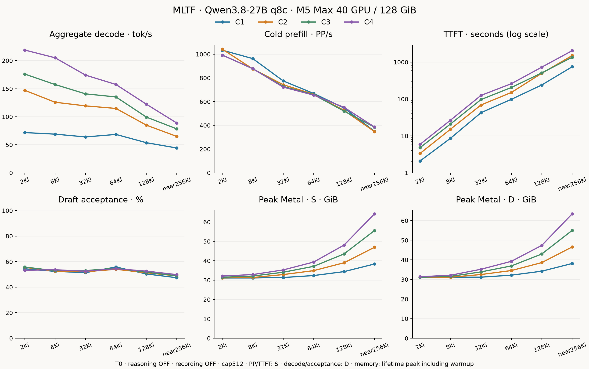

# MLTF · My Little Trie Forge

<p align="center"></p>

[한국어](README.ko.md) · [中文](README.zh.md) · [Full benchmarks](docs/BENCHMARKS.md) · [Pi demo](docs/DEMO.md) · [Install](docs/INSTALL.md)

**8-bit Qwen3.8-27B. Fast local coding. 256Ki context.**

MLTF runs Qwen3.8-27B on an M5 Max MacBook Pro with a focus on speed and memory efficiency. Its Metal kernels and caches specialize in one model and machine.

## Measured performance

**MacBook Pro · M5 Max · 40 GPU cores · 128GiB unified memory**

| Single-request cold prefill (2Ki) | Single-request TTFT | Single-request decode | Four-request aggregate decode |
|---:|---:|---:|---:|
| **1,033.8 PP/s** | **2.094 s** | **71.7 tok/s** | **218.9 tok/s** |

## Demo videos

**C1 demo**

[](docs/media/pi-c1-xhigh-t1-4k30.mp4)

**C4 demo**

[](docs/media/pi-c4-xhigh-t1-4k30.mp4)

Actual coding with reasoning visible: xhigh, temperature 1, 128Ki output cap. Full recordings play at **4K, 30fps, 1×**.

[C1 full video](docs/media/pi-c1-xhigh-t1-4k30.mp4) · [C4 full video](docs/media/pi-c4-xhigh-t1-4k30.mp4) · [Tests and recorder overhead](docs/DEMO.md)

## Features

- Qwen3.8-specific Metal kernels, 8-bit prefill, DFlash2 verification and INT8 KV caching.
- Prefix-tree context reuse with an optional SSD cache.
- Concurrency admission based on available memory.

## Performance by context



`C` is concurrent request count. PP/s measures input tokens per second; TTFT ends at the first content token. PP/TTFT use natural serving (S), decode/acceptance use all-ready runs (D), and memory reports their separate Metal peaks.

**T0, reasoning OFF, recording OFF, cap512.** Cold requests do not reuse KV cache. Throughput/TTFT are medians; memory is the maximum.

| Input/request | C | Cold PP/s | TTFT (s) | Decode tok/s | Acceptance | Memory S/D (GiB) |
|---|---:|---:|---:|---:|---:|---:|
| 2Ki | 1 | 1,033.8 | 2.094 | 71.7 | 54.4% | 31.135 / 31.134 |
|  | 2 | 1,042.0 | 3.352 | 147.1 | 55.6% | 31.135 / 31.134 |
|  | 3 | 992.7 | 4.823 | 176.1 | 55.8% | 31.483 / 31.134 |
|  | 4 | 992.4 | 5.925 | 218.9 | 53.3% | 32.119 / 31.388 |
| 8Ki | 1 | 963.0 | 8.638 | 68.9 | 52.4% | 31.135 / 31.134 |
|  | 2 | 876.0 | 15.230 | 125.8 | 52.6% | 31.355 / 31.134 |
|  | 3 | 877.9 | 21.073 | 157.3 | 52.9% | 32.118 / 31.569 |
|  | 4 | 877.8 | 26.745 | 205.1 | 53.7% | 32.881 / 32.150 |
| 32Ki | 1 | 774.7 | 42.493 | 63.9 | 51.4% | 31.354 / 31.171 |
|  | 2 | 742.8 | 68.913 | 119.3 | 52.1% | 32.879 / 32.513 |
|  | 3 | 728.4 | 96.560 | 140.7 | 53.0% | 34.077 / 33.855 |
|  | 4 | 722.5 | 125.141 | 174.2 | 52.5% | 35.275 / 35.196 |
| 64Ki | 1 | 669.2 | 98.185 | 68.4 | 55.8% | 32.370 / 32.187 |
|  | 2 | 662.3 | 150.536 | 114.7 | 54.0% | 34.910 / 34.544 |
|  | 3 | 658.8 | 205.471 | 135.2 | 54.8% | 37.124 / 36.901 |
|  | 4 | 655.2 | 260.602 | 157.4 | 54.5% | 39.338 / 39.259 |
| 128Ki | 1 | 546.0 | 240.434 | 53.7 | 50.4% | 34.401 / 34.218 |
|  | 2 | 525.9 | 499.021 | 84.9 | 51.3% | 38.972 / 38.607 |
|  | 3 | 520.1 | 510.612 | 99.3 | 51.7% | 43.544 / 42.995 |
|  | 4 | 551.8 | 731.879 | 122.3 | 52.6% | 48.115 / 47.384 |
| near256Ki | 1 | 349.1 | 749.930 | 44.2 | 47.4% | 38.337 / 38.153 |
|  | 2 | 347.2 | 1,507.903 | 64.8 | 48.9% | 46.971 / 46.605 |
|  | 3 | 385.5 | 1,358.865 | 78.3 | 49.0% | 55.604 / 55.056 |
|  | 4 | 386.0 | 2,047.129 | 88.7 | 49.8% | 64.238 / 63.507 |

[Full samples, ranges and actual B/R](docs/BENCHMARKS.md) · [Earlier comparisons](docs/COMPARISON_ARCHIVE.md)

## Same-machine comparison with oMLX 0.7.0

Measured on the same M5 Max MacBook Pro with 40 GPU cores and 128GiB
unified memory, using the same Qwen3.8-27B 8-bit target source and
DFlash2 draft.

Single request (C1), cold cache, reasoning OFF, temperature 1.0,
top_p 0.95, top_k 20, and a 512-token output cap. Values are medians:
n=5 at 4Ki and 32Ki, and n=3 at the other input lengths.
Tested oMLX 0.7.0 commit: `4d4f5a2`.

### Client-observed decode throughput

Higher is better. The percentage compares the measured median throughputs.

| Input tokens | MLTF 0.1.1 q8c / DFlash2 (tok/s) | oMLX 0.7.0 8-bit / DFlash2 (tok/s) | MLTF throughput increase |
|---:|---:|---:|---:|
| 1Ki | 65.08 | 49.11 | +33% |
| 4Ki | 67.67 | 43.04 | +57% |
| 16Ki | 69.39 | 38.72 | +79% |
| 32Ki | 52.37 | 36.81 | +42% |
| 64Ki | 60.17 | 35.98 | +67% |

### Time to first token

Lower is better. Both columns use the same client-side TTFT
measurement method.

| Input tokens | MLTF 0.1.1 q8c / DFlash2 (s) | oMLX 0.7.0 8-bit / DFlash2 (s) |
|---:|---:|---:|
| 1Ki | 1.174 | 1.646 |
| 4Ki | 4.489 | 5.558 |
| 16Ki | 18.727 | 22.613 |
| 32Ki | 40.243 | 47.510 |
| 64Ki | 92.157 | 108.570 |

These are previously recorded same-machine comparisons, separate
from the T0 / reasoning-OFF 24-cell characterization above; no new
competitor benchmark was run for this README update. MLTF uses INT8
KV, while oMLX uses its stock unquantized cache with TurboQuant OFF,
so cache precision is not matched. Results apply to this tested
hardware, workload and configuration, not all models or Macs.
Client streaming event batching is a measurement limitation.

[Full comparison methodology, sample ranges and artifact identities](docs/COMPARISON_ARCHIVE.md)

## Start locally

Use the [prepared q8c checkpoint](https://huggingface.co/Ho-Jin-93/Qwen3.8-27B-MLTF-q8c). First review the [model terms](MODEL_ASSETS.md).

```sh
# 1. Install
brew install hojin12312/mltf/mltf
# 2. Download the model
mltf download --model Ho-Jin-93/Qwen3.8-27B-MLTF-q8c --accept-model-licenses
# 3. Serve
mltf serve --model Ho-Jin-93/Qwen3.8-27B-MLTF-q8c --max-context 256K --max-memory 96G
```

Default address: `127.0.0.1:8000`; SSD caching is OFF. See [installation instructions](docs/INSTALL.md) for memory/SSD limits and model preparation requirements.

`--max-concurrent-requests` 1–4 optionally caps active generation requests; extra requests wait FIFO within the existing safety limits. Omitting it keeps automatic concurrency, and it does not change physical batch width. See [active request limit](docs/MAX_CONCURRENT_REQUESTS.md).

MLTF checks GitHub Releases at most once every 24 hours for a newer stable release and, only when one exists, prints one line at startup and shows a small notice in `/status` and the Web UI. The check is cached, runs in the background after the server is Ready and never delays or affects inference; failures stay silent. It never downloads or installs anything and sends no telemetry. Disable it with `mltf serve --no-update-check` or `MLTF_NO_UPDATE_CHECK=1`. See [update notification](docs/INSTALL.md#update-notification).


Python installation: `pip install https://github.com/hojin12312/my-little-trie-forge/releases/download/v0.1.2/my_little_trie_forge-0.1.2-py3-none-macosx_26_0_arm64.whl` or `uv tool install https://github.com/hojin12312/my-little-trie-forge/releases/download/v0.1.2/my_little_trie_forge-0.1.2-py3-none-macosx_26_0_arm64.whl`. See [prepare-q8c](MODEL_ASSETS.md) for source conversion.

## Support

Validated on **M5 Max, 40 GPU cores / 128GiB**. Requires macOS 26.4 or newer and the necessary GPU features. Physical decode scope is B1–B4; the 262,144-token context limit includes output. See [validation and support scope](docs/VALIDATION.md).

## Open-source foundations

MLTF is an **Apache-2.0 project derived from Splash**. DFlash2, KV, serving and cache upstream contributions and notices remain in [LICENSE](LICENSE), [UPSTREAM.md](UPSTREAM.md), [THIRD_PARTY_NOTICES.md](THIRD_PARTY_NOTICES.md) and [ACKNOWLEDGEMENTS.md](ACKNOWLEDGEMENTS.md).
