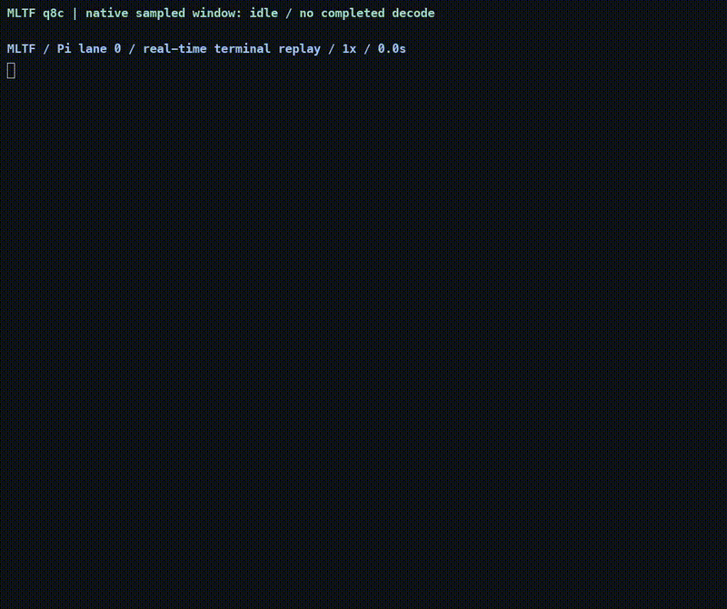
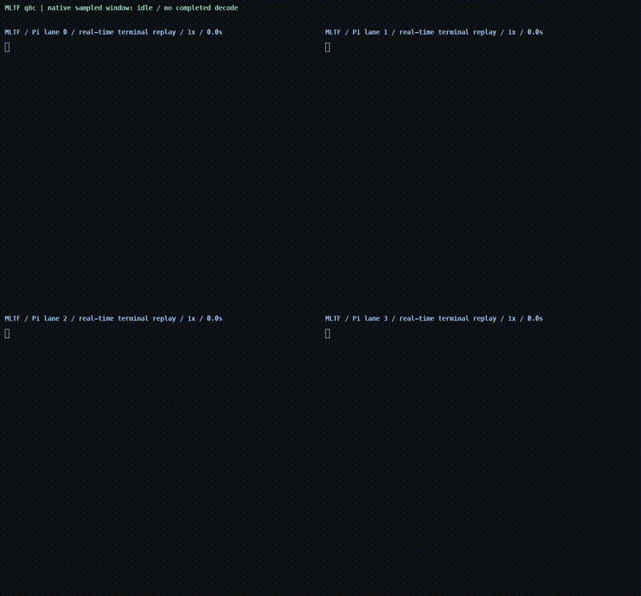

# Pi에서 로컬 MLTF 코딩

실제 Pi가 파일 읽기·수정·테스트를 수행한 timestamp 기반 터미널 기록입니다. 1× 재생이며 idle 압축은 없습니다. 화면 capture와 구분합니다.

Pi0.87.1 · 로컬 MLTF Qwen3.8-27B q8c · M5 Max GPU40코어/128GiB · T0 · thinking OFF. 확장·스킬·프롬프트·테마·컨텍스트 자동 발견은 모두0입니다. Wrapper/preload를 우회하고 설치된 core는 유지했으며 read/bash/edit/write 도구를 사용했습니다. 사용자 Pi 설치와 전역 설정은 변경하지 않았습니다.

격리 frontend launcher: [run-pi-demo.sh](../benchmarks/run-pi-demo.sh). 로컬 서버를 먼저 실행하면 launcher가 포함된 audited synthetic fixture를 새 임시 작업공간에 준비합니다. 새 config와 session 경로는 출력 후 보존하며 전역 설정을 변경하지 않습니다. 영상 기록은 별도의 private campaign harness로 수행했습니다.

```sh
./benchmarks/run-pi-demo.sh --port 8000
```

공유용 재생본에서는 로컬 계정명과 home 경로만 같은 문자 폭으로 가렸습니다. 이벤트 순서·원래 timestamp·대기 시간·실패와 재시도는 그대로이며, 수정하지 않은 원본 master는 비공개 증거에 보존했습니다. Metadata에서 원본과 privacy projection hash를 구분합니다.

## C1 실제 코딩

결과: 1/1 lane이 파일을 수정하고 기록된 모델 실행 테스트와 독립적인 취소·이전 작업 대체 검사를 통과했습니다. 실패·재시도·도구 대기 시간도 원본 기록에 남아 있습니다.

[Uncut1× MP4](media/pi-c1-1x.mp4) · [Timing/artifact metadata](media/pi-c1-metadata.json)

[](media/pi-c1-1x.mp4)

최초 cold 요청과 각 turn의 cache 재사용은 비공개 요청·세션 증거에 보존했습니다. Usage에 실제 기록된 cache hit만 설명합니다. C1은 작업공간1개를 사용하며 실제 물리 dispatch 횟수는 {'1': 299, '2': 0, '3': 0, '4': 0}.

각 lane 최초 요청의 실제 cached token: [0]. 전체 모델 요청 중 cache 재사용은 11/12회이며, 요청별 input·output·cached token·TTFT는 영상 metadata에 기록했습니다.

## C4 실제 코딩

결과: 4/4 lane이 파일을 수정하고 기록된 모델 실행 테스트와 독립적인 취소·이전 작업 대체 검사를 통과했습니다. 실패·재시도·도구 대기 시간도 원본 기록에 남아 있습니다.

[Uncut1× MP4](media/pi-c4-1x.mp4) · [Timing/artifact metadata](media/pi-c4-metadata.json)

[](media/pi-c4-1x.mp4)

최초 cold 요청과 각 turn의 cache 재사용은 비공개 요청·세션 증거에 보존했습니다. Usage에 실제 기록된 cache hit만 설명합니다. C4는 독립 작업공간4개를 사용하며 실제 물리 dispatch 횟수는 {'1': 122, '2': 94, '3': 33, '4': 181}.

각 lane 최초 요청의 실제 cached token: [0, 0, 1024, 1024]. 전체 모델 요청 중 cache 재사용은 49/51회이며, 요청별 input·output·cached token·TTFT는 영상 metadata에 기록했습니다.

C4의 최초 두 요청은 cached token0이었고, 같은 새 backend에서 이후 두 최초 요청은 공통 prefix1024토큰을 재사용했습니다. 이를 네 요청 모두 cold인 측정으로 표현하지 않습니다.

## 녹화 부하

공식 측정표는 녹화 OFF입니다. 녹화 비교는 동일한 Pi TUI와 고정된 코드 리뷰 요청을 사용하고 매번 새 세션·작업공간·backend에서 각 C당3쌍을 순서 균형을 맞춰 실행했습니다. 기본 도구는 유지했습니다.

| C | OFF native decode 중앙값 tok/s | ON native decode 중앙값 tok/s | 쌍별 slowdown 중앙값 [범위] | 쌍 수 |
|---|---:|---:|---:|---:|
| 1 | 70.39 | 70.40 | -0.05% [-0.29–0.13] | 3 |
| 4 | 200.14 | 200.25 | 0.01% [-1.92–1.31] | 3 |

Slowdown=100×(1−TPS_ON/TPS_OFF)입니다. 출력·acceptance·실제 B의 차이는 [쌍별 데이터](data/recording-overhead.json)에 보존했습니다. 출력이 다른 쌍은 차이를 녹화 부하만의 영향으로 해석할 수 없습니다. PTY 기록에는 화면 capture FPS나 drop-frame 지표가 없으며, 재생 영상은 오프라인12fps로 렌더링하고 원본·영상 길이 차이가2프레임 이내인지 검증했습니다.

원본 cast·세션·요청 이벤트·카운터·테스트 출력·원본 및 영상 hash·개인정보 검사는 비공개 증거에 보존했습니다. 마이크·시스템 오디오·카메라는 OFF입니다. 

추가 분리 control: 서로 다른 출력이 생긴 C4 두 쌍은 native TPS의 차이를 녹화만의 영향으로 해석하지 않습니다. 동일한 실제 C4 이벤트를 OFF/ON 순서3쌍으로 고정 재생하여 JSON serialization·write·flush CPU/I/O 비용을 별도로 측정했습니다. 모델 성능과 별도로 기록 파일의 비용을 검사하는 unpaced microcontrol이며 GPU 요청은0입니다. 원본 C4 기록당 추가 CPU 비용 중앙값은 12.12ms입니다. [별도 범위와 원본 hash](data/recorder-fixed-trace-control.json)를 참조하세요.

녹화 컨트롤러의 EOF·turn 제한 문제로 제외한 초기 take4개는 비공개 원본·세션·작업공간·hash와 함께 보존했습니다. 동일한 task·model·sampling·cap으로 처음 정상 완료된 기록을 사용했으며, 모델의 실패·수정·재시도는 편집하지 않았습니다.
